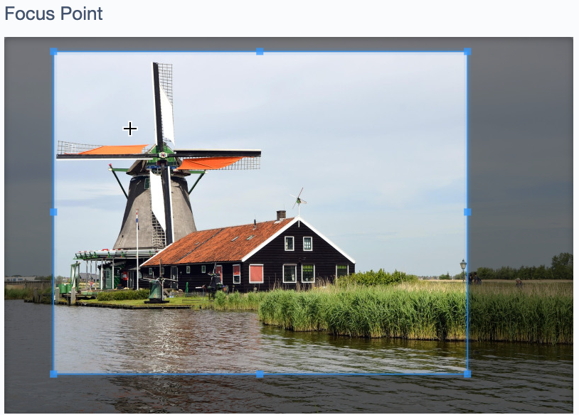
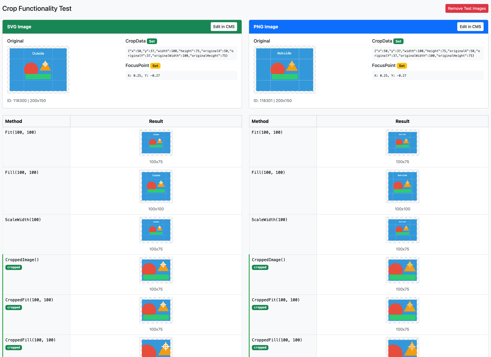

# FocusPointCropper: Smarter Image Cropping for Silverstripe

*Maintained by [Restruct](https://github.com/restruct). If this module saves you time, you can
[support ongoing maintenance](https://github.com/sponsors/restruct).*

This module adds a visual crop interface to Silverstripe's AssetAdmin, building on top of [jonom/focuspoint](https://github.com/jonom/silverstripe-focuspoint). It allows editors to define an initial crop region that serves as the basis for FocusPoint's intelligent cropping.



*Set crop & zoom level (drag/scroll) and FocusPoint (click) directly in the CMS.*

<small>Image by [Nikolay Nachev](https://pixabay.com/users/na4ev-1481419/?utm_source=link-attribution&utm_medium=referral&utm_campaign=image&utm_content=988046) (Pixabay)</small>

## Version Compatibility

| Branch | Module Version | Silverstripe | FocusPoint | PHP |
|--------|----------------|--------------|------------|-----|
| `master` | `3.x` | `^5 \|\| ^6` | `^5 \|\| ^6` | `^8.1` (SS5) / `^8.3` (SS6) |
| (tags only) | `2.0.x` | `^4 \|\| ^5` | `^3`, later `^4 \|\| ^5` | `^7.4 \|\| ^8.0` |
| (tags only) | `1.x` | `^3` | `~2.1` | |

`composer.json` is the source of truth for exact version constraints. This module replaces the
older `micschk/silverstripe-focuspointcropper` package.

Silverstripe 4 reached end of life in April 2025 and is no longer supported or tested here. Projects
still on it should stay on the `2.0.x` tags, which remain available. Upgrading from 2.x? See
[UPGRADING.md](UPGRADING.md) and [CHANGELOG.md](CHANGELOG.md).

## Requirements and installation

- Silverstripe 5 (PHP 8.1+) or 6 (PHP 8.3+, which Silverstripe 6 itself requires)
- [jonom/focuspoint](https://github.com/jonom/silverstripe-focuspoint) `^5` (Silverstripe 5) or `^6` (Silverstripe 6)
- [restruct/silverstripe-simpler](https://github.com/restruct/silverstripe-simpler) `~0.2` (Silverstripe 5) or `^1` (Silverstripe 6; the first 1.x release is pending, and until it is out this module cannot be installed on Silverstripe 6)
- `ext-gd` (or Imagick) for the raster crop, as for any Silverstripe image manipulation

```bash
composer require restruct/silverstripe-focuspointcropper
```

Then flush and build the database (`sake dev/build flush=1` on Silverstripe 5,
`sake db:build --flush` on 6): the module adds a `CropData` column to `Image`.

## Basic Usage

When you edit an image in the CMS (AssetAdmin), an extra "Focus Point + Crop" field appears:

1. **Scroll** on the image to zoom in/out
2. **Drag** the image to pan and position the crop area
3. **Click** on the subject of the image to set the focus point
4. **Save** the image to apply the crop data

The crop data is stored on the image and used as the basis for all subsequent manipulations.

## How It Works

### CropData Storage

When you define a crop region in the CMS, the module stores `CropData` as JSON on the Image record. This contains:
- Crop region coordinates (x, y, width, height)
- Zoom level
- Canvas dimensions

### Image Manipulation Methods

The module adds several manipulation methods to `Image`:

Every method first applies the stored CropData region, then the manipulation it is named after.
Without CropData (or with CropData covering the whole image) they behave exactly like the plain
method. The result is a normal image variant, generated once and cached.

**Cropped Methods** - Apply CropData before standard manipulation:
- `CroppedImage()` - Just the cropped region, at its original resolution
- `CroppedFill($width, $height)`, `CroppedFillMax($width, $height)`
- `CroppedFit($width, $height)`, `CroppedFitMax($width, $height)`
- `CroppedScaleWidth($width)`, `CroppedScaleMaxWidth($width)`, `CroppedScaleHeight($height)`, `CroppedScaleMaxHeight($height)`
- `CroppedResizedImage($width, $height)`
- `CroppedCropWidth($width)`, `CroppedCropHeight($height)`
- `CroppedPad($width, $height, $backgroundColor = 'FFFFFF', $transparencyPercent = 0)`

**Focus-Aware Cropped Methods** - Combine CropData with FocusPoint. The focus point is moved into
the cropped frame first, so it keeps pointing at the same subject:
- `CroppedFocusFill($width, $height)` - Uses both CropData and FocusPoint for optimal results
- `CroppedFocusFillMax($width, $height)` - Same, without upscaling
- `CroppedFocusCropWidth($width)` - Crop to width, respecting both crop region and focus point
- `CroppedFocusCropHeight($height)` - Crop to height, respecting both crop region and focus point

**Aliases** kept from 1.x: `CroppedFocusedImage($width, $height)` (= `CroppedFocusFill`) and
`CroppedImageOnly($width, $height)` (= `CroppedFill`).

`CroppedOffsetFocusFill($width, $height, $offsetHorizontal = 0, $offsetVertical = 0)` is work in
progress: horizontal offset only (a vertical offset raises an error).

### SVG Support

When used together with [restruct/silverstripe-svg-images](https://github.com/restruct/silverstripe-svg-images), all crop methods work seamlessly with SVG files. The svg-images module automatically detects when this module is installed and enables crop support for SVGs.

## Template Usage

```html
<!-- Standard manipulation (uses CropData if set) -->


<!-- Focus-aware cropping (uses both CropData and FocusPoint) -->


<!-- Fallback for images without CropData -->

```

## Development Tools

### Crop Functionality Test Page

A visual comparison tool is available at `/dev/crop-compare` to test crop functionality with both SVG and PNG images.
It is open to anyone in dev mode; otherwise only to administrators (`ADMIN` or `ALL_DEV_ADMIN`).



The tool:
- Tests all Cropped* methods (CroppedImage, CroppedFill, CroppedFocusFill, etc.)
- Compares regular manipulations with Cropped* versions
- Shows badges indicating which methods use CropData and/or FocusPoint
- Includes bundled test images with pre-configured CropData and FocusPoint
- Works with custom image IDs for testing your own images

**Test Image Features:**
- **Dashed lines** mark the crop boundaries
- **White crosshair** marks the FocusPoint location
- **Orange triangle** is near the FocusPoint - should stay visible in FocusFill crops
- **Red circle** is left of center - may be cropped in narrow FocusFill

### Republishing crop data: `PublishCropDataTask`

Crop data is saved on the draft image. For published images whose live version has no CropData
while the draft does, this task republishes them, 100 per run (run it again for the next batch):

```bash
vendor/bin/sake dev/tasks/PublishCropDataTask   # Silverstripe 5
vendor/bin/sake tasks:PublishCropDataTask       # Silverstripe 6
```

Images whose live version already has (other) CropData are left alone.

## Configuration

`cropconfig` is fed to the JS cropper as-is. It is configured on `Image` (the extension's config
is merged into the class it is applied to):

```yaml
SilverStripe\Assets\Image:
  cropconfig:
    aspectRatio: 1.777  # 16:9 ratio
    autoCropArea: 0.8   # Initial crop covers 80% of image
```

Defaults: `autoCropArea: 1`, `movable: false`, `rotatable: false`, `scalable: false`,
`zoomable: false`. For all available cropper options, see
[Cropper.js 1.5 documentation](https://github.com/fengyuanchen/cropperjs/blob/v1.5.11/README.md#options) (the bundled version).

The CMS preview the cropper works on is FocusPointField's, which this module sets to at most
400x300:

```yaml
JonoM\FocusPoint\Forms\FocusPointField:
  max_width: 400
  max_height: 300
```

## Related Modules

- [jonom/focuspoint](https://github.com/jonom/silverstripe-focuspoint) - Required. Provides the FocusPoint field and basic focus-aware cropping
- [restruct/silverstripe-svg-images](https://github.com/restruct/silverstripe-svg-images) - Optional. Enables full SVG support including crop methods
- [restruct/silverstripe-simpler](https://github.com/restruct/silverstripe-simpler) - Required. Provides the `DOMNodesInserted` event the cropper script initialises on

## Running the tests

The suite needs a booted Silverstripe project. Install the module into one through a path
repository with `"symlink": true` (the `tests/` folder is excluded from dist installs), map
`Restruct\ImageCropper\Tests\` to `vendor/restruct/silverstripe-focuspointcropper/tests/` in its
`autoload-dev`, then:

```bash
# Silverstripe 5 (PHPUnit 9): the path must come first for flush=1 to work
vendor/bin/phpunit vendor/restruct/silverstripe-focuspointcropper/tests flush=1
# Silverstripe 6 (PHPUnit 11): flush through the environment instead
SS_PHPUNIT_FLUSH=1 vendor/bin/phpunit vendor/restruct/silverstripe-focuspointcropper/tests
```

`.github/workflows/ci.yml` builds such a project per Silverstripe major.

## License

BSD-3-Clause, see [LICENSE](LICENSE), as every earlier release declared.
